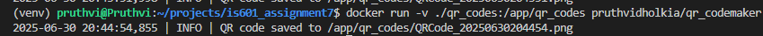
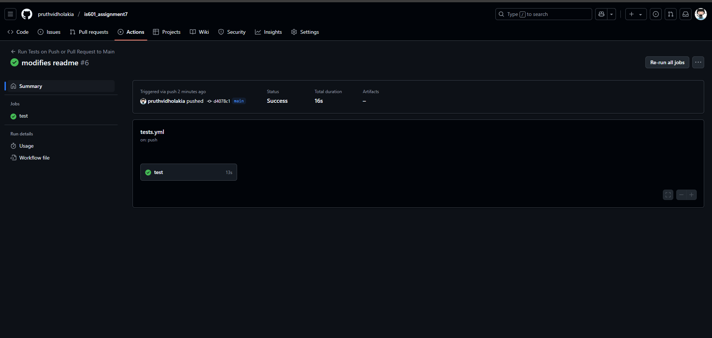

# IS601 - Assignment 7: QR Code Generator

This assignment demonstrates the use of Python, unit testing, code coverage, Docker, and CI workflows by building a simple **QR Code Generator**.

## My Github Repository
  
[Visit the GitHub Repository](https://github.com/pruthvidholakia/is601_assignment7)

---

## My DockerHub Image
  
[Visit the DockerHub Page](https://hub.docker.com/r/pruthvidholkia/qr_codemaker)

---

## QR Code Creation Screenshot
  
[This screenshot shows successful QR code creation inside Docker with volume mount.]

---

## GitHub Actions Workflow Screenshot
  
[This screenshot shows the passing CI pipeline with 100% test coverage.]

---

## 🔧 Features

- Generates a QR code for any valid URL
- Saves QR codes with timestamped filenames in a `qr_codes/` directory
- Environment variables support for customizing QR colors and output folder
- 100% test coverage with `pytest` and `pytest-cov`
- GitHub Actions workflow for automated testing and coverage enforcement
- Dockerized for consistent builds and usage

---

## 🚀 Usage

Run the CLI from terminal:

```bash
python main.py --url https://example.com